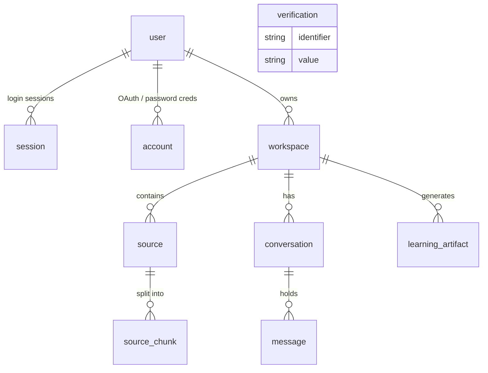

# Manthan — Data Model aur Flow

Yeh document batata hai ki `server/prisma/schema.prisma` ke saare models aapas me kaise jude hain,
data kis order me banta hai, aur ek request server ke andar kaunse layers se guzarti hai.

---

## 1. Ek line me pura idea

> **User** login karta hai → apna **Workspace** (ek notebook) banata hai → us workspace me **Source**
> (PDF / website / YouTube / text) daalta hai → har source **SourceChunk** me toot-ta hai (RAG ke liye)
> → user workspace me **Conversation** shuru karta hai, jisme **Message** aate-jaate hain aur jawab
> chunks se citations ke saath aata hai → usi content se **LearningArtifact** (summary, quiz, flashcards,
> mindmap) generate hote hain.

Har cheez **workspace ke andar scoped** hai. Workspace hi tenancy boundary hai.

---

## 2. Relationship map (ER diagram)



`verification` kisi se FK se juda nahi hai — yeh Better Auth ka standalone table hai
(email verify / password reset tokens), jo `identifier` (email ya token key) se lookup hota hai.

### Cardinality table

| Parent | Child | Type | Delete rule |
|---|---|---|---|
| `User` | `Session` | 1 → N | Cascade |
| `User` | `Account` | 1 → N | Cascade |
| `User` | `Workspace` | 1 → N | Cascade |
| `Workspace` | `Source` | 1 → N | Cascade |
| `Workspace` | `Conversation` | 1 → N | Cascade |
| `Workspace` | `LearningArtifact` | 1 → N | Cascade |
| `Source` | `SourceChunk` | 1 → N | Cascade |
| `Conversation` | `Message` | 1 → N | Cascade |

**Cascade ka matlab:** user delete → uske saare workspaces → unke saare sources, chunks,
conversations, messages, artifacts — sab automatically DB level pe delete. Application code me
manual cleanup likhne ki zaroorat nahi.

**Ek exception:** `LearningArtifact.sourceIds` ek plain `String[]` hai, foreign key **nahi**.
Yaani agar koi source delete ho jaye, to artifact me uski id dangling reh jayegi. Agar strict
integrity chahiye to isko join table (`ArtifactSource`) banana padega — abhi trade-off yeh hai ki
snapshot-style artifact source delete hone ke baad bhi bacha rehta hai.

---

## 3. Model-by-model breakdown

### Auth block (Better Auth ka standard schema)

| Model | Kaam | Key fields |
|---|---|---|
| `User` | Identity. `email` unique. | `email @unique`, `emailVerified`, `image` |
| `Session` | Active login. Cookie ka `token` yahan match hota hai. | `token @unique`, `expiresAt`, `userId` |
| `Account` | Provider linkage (Google OAuth) + tokens. | `providerId`, `accountId`, `accessToken`, `refreshToken` |
| `Verification` | Short-lived tokens (email verify etc). | `identifier`, `value`, `expiresAt` |

Ek user ke multiple `Account` ho sakte hain (Google + credential dono ek hi email pe) —
isliye `Account` alag table hai, `User` me merge nahi.

### Product block

**`Workspace`** — notebook/project. `defaultModel` (default `"gpt-4o-mini"`) batata hai ki is
workspace ke chat aur artifacts kis LLM se chalein. Yeh per-workspace hai, global nahi, taaki alag
notebooks alag models use kar sakein.

**`Source`** — ek ingested document.
- `type: SourceType` → `PDF | WEBSITE | YOUTUBE | TEXT | MARKDOWN`
- `status: SourceStatus` → `PENDING → PROCESSING → READY` (ya `FAILED`)
- `content` = extracted plain text, `url` = original link (PDF/website ke liye)
- `metadata: Json?` = type-specific extra (page count, video duration, author...)

**`SourceChunk`** — retrieval ki asli unit. Source ka text chhote pieces me toot ke yahan aata hai.
- `index` = source ke andar chunk ka order; `@@unique([sourceId, index])` duplicate chunk insert rokta hai
- `tokenCount` = context budget calculate karne ke liye
- Yeh table hi RAG ka backbone hai — embeddings isi pe lagenge (docker-compose me `pgvector/pgvector:pg16`
  image use ho rahi hai, yaani vector column yahin add hoga)

**`Conversation`** — ek chat thread, workspace ke andar.
- `summary` + `summaryMessageCount` + `summarizedAt` = **rolling summarization**. Jab messages
  zyada ho jayein, purane messages ka summary bana ke store kar lo, aur prompt me poori history ki
  jagah `summary + last N messages` bhejo. `summaryMessageCount` batata hai ki summary kitne messages
  tak cover karta hai, taaki dobara wahi messages summarize na ho.

**`Message`** — `role: USER | ASSISTANT`, `content`, aur `citations: Json?`.
`citations` me chunk references store hote hain (kaunse `sourceId`/`chunkId` se yeh answer bana),
isliye UI answer ke neeche source cards dikha sakta hai.

**`LearningArtifact`** — generated study material.
- `type: SUMMARY | TAKEAWAYS | FLASHCARDS | QUIZ | MINDMAP | REPORT`
- `content: Json?` — har type ka apna shape (quiz = questions array, flashcards = Q/A pairs, mindmap = tree)
- `status` `Source` jaisa hi async lifecycle follow karta hai (generation background job hai)
- `sourceIds` = kin sources se banaya gaya

---

## 4. Lifecycle flows

### 4.1 Auth flow

```
Browser (Next.js client)
   │  "Continue with Google"
   ▼
POST/GET  /api/auth/*   ──► toNodeHandler(auth)   [src/index.ts]
   │
   ▼
Better Auth  ──prismaAdapter──►  user / account / session / verification
   │
   ▼
Set-Cookie: session token  (credentials: true + CORS origin = CLIENT_URL)
```

Har protected request pe `requireAuth` middleware chalta hai:
`auth.api.getSession(headers)` → session nahi mila to `401`, mila to `req.session` set karke `next()`.
Iske baad har handler `req.session.user.id` ko ownership check ke liye use karta hai.

### 4.2 Workspace flow

```
POST /api/workspaces  { title, description?, icon?, defaultModel? }
   │
   ├─ requireAuth              → req.session.user.id
   ├─ createWorkspaceSchema    → zod validation (title 1–120, defaultModel ∈ CHAT_MODELS)
   ├─ service                  → business rules
   └─ repository               → prisma.workspace.create({ userId, ...data })
```

Read/update/delete hamesha **userId ke saath** query karte hain
(`findWorkspaceByIdAndUserId`) — yahi horizontal access control hai, taaki koi apni id badal ke
dusre ka workspace na padh le.

### 4.3 Source ingestion flow (RAG ka pehla half)

```
Upload PDF / paste URL / paste text
        │
        ▼
  Source row banti hai  ─────────────► status = PENDING
        │
        ▼
  Background processing            ─► status = PROCESSING
        │  ├─ PDF   → text extract
        │  ├─ WEBSITE → scrape + clean HTML
        │  ├─ YOUTUBE → transcript fetch
        │  └─ TEXT/MARKDOWN → as-is
        ▼
  Chunking (overlap ke saath)  →  SourceChunk[0..n]  (index, content, tokenCount)
        │
        ▼
  Embedding → pgvector column
        │
        ▼
  status = READY     (fail hua to FAILED + metadata me reason)
```

Status enum ka poora point yahi hai: UI `PENDING/PROCESSING` pe spinner dikhaye, `READY` hone pe hi
source ko chat me selectable banaye, `FAILED` pe retry button de.

### 4.4 Chat flow (RAG ka doosra half)

```
User message
   │
   ▼
Message (role = USER) save
   │
   ▼
Query embed  ──►  vector search over SourceChunk (workspace ke sources tak seemit)
   │
   ▼
Top-K chunks  +  Conversation.summary  +  last N messages   ──►  prompt
   │
   ▼
LLM (workspace.defaultModel)
   │
   ▼
Message (role = ASSISTANT, citations = [{sourceId, chunkId, ...}]) save
   │
   ▼
Agar messages > threshold  →  summary regenerate, summaryMessageCount / summarizedAt update
```

Retrieval hamesha `workspace → sources → chunks` chain se filter hota hai, isliye ek workspace ka
data kabhi doosre workspace ke jawab me leak nahi hota.

### 4.5 Artifact flow

```
"Generate Quiz" click  →  LearningArtifact { type: QUIZ, sourceIds: [...], status: PENDING }
                              │
                              ▼
                       PROCESSING → chunks fetch → LLM → content (Json)
                              │
                              ▼
                          READY  (ya FAILED)
```

Same async pattern jaisa `Source` ka hai — client status poll karta hai ya stream sunta hai.

---

## 5. Request ka layered path (server architecture)

```
HTTP request
   │
   ▼
index.ts ─ app.all("/api/auth/*")  ──────────────► Better Auth (bypasses baaki stack)
   │
   ├─ cors({ origin: CLIENT_URL, credentials: true })
   ├─ express.json()
   │
   ▼
routes/*.route.ts        ── URL → handler mapping
   │
   ▼
middleware/requireAuth   ── session verify, req.session set (warna 401)
   │
   ▼
validators/*.validator   ── zod se body/params parse (galat input → ZodError)
   │
   ▼
controllers/*.controller ── req/res handling, asyncHandler() me wrapped
   │
   ▼
services/*.service       ── business logic, ownership checks, AppError throw
   │
   ▼
repositories/*.repository── sirf Prisma queries, `select` se field whitelist
   │
   ▼
lib/db.ts (Prisma singleton + PrismaPg adapter) ──► PostgreSQL (pgvector)
```

**Error path:** kahin bhi throw hua → `asyncHandler` `next(err)` karta hai →
`errorHandler` middleware type ke hisaab se map karta hai:

| Error | Status |
|---|---|
| `AppError` (`NotFound`/`Validation`/`Unauthorized`/`Conflict`) | uska apna `statusCode` |
| `ZodError` | 400 + `fieldErrors` |
| `MulterError` / "Only PDF files are allowed" | 400 |
| Cloudinary 403 | 400 + fix ka hint |
| baaki sab | 500 (server pe log, client ko generic message) |

`workspaceSelect` (repository me) deliberately `userId` ko response se bahar rakhta hai — internal
column client tak nahi jaata.

---

## 6. Indexes kyun hain wahan jahan hain

| Index | Kaunsi query fast karta hai |
|---|---|
| `workspace(userId)` | sidebar: "mere saare workspaces" |
| `source(workspaceId)` | workspace ki source list |
| `source(workspaceId, type)` | type filter (sirf PDFs dikhao) |
| `source(workspaceId, status)` | pending/processing sources poll karna |
| `source_chunk(sourceId)` + `unique(sourceId, index)` | ordered chunk fetch + duplicate insert se safety |
| `conversation(workspaceId, updatedAt)` | "recent chats" list, latest pehle |
| `message(conversationId, createdAt)` | chat history chronological, paginated |
| `learning_artifact(workspaceId, type/status)` | artifact tabs + polling |
| `session(token)` unique, `session(userId)` | har request pe session lookup |

Pattern saaf hai: **jis column pe filter karte ho + jis pe sort karte ho, dono ka composite index.**

---

## 7. Abhi ki reality (code vs schema)

Doc padhte waqt yeh dhyan rahe — schema aage hai, code peeche:

- **Migrated (DB me maujood):** `testTable`, `user`, `session`, `account`, `verification`, `workspace`
  (`server/prisma/migrations/`)
- **Sirf schema me, migration abhi baaki:** `Source`, `SourceChunk`, `Conversation`, `Message`,
  `LearningArtifact` aur unke enums → inke liye `npx prisma migrate dev` chalana padega
- **Server me implemented:** `lib/auth.ts`, `lib/db.ts`, `requireAuth`, `errorHandler`,
  `asyncHandler`, `workspace.repository.ts`, `workspace.validator.ts`
- **Abhi khaali files:** `routes/index.ts`, `routes/workspace.route.ts`,
  `controllers/workspace.controller.ts`, `services/workspace.service.ts` — yaani workspace endpoints
  abhi `index.ts` me mount nahi hue, sirf `/` aur `/health` live hain
- **Missing import:** `workspace.validator.ts` `../lib/ai-config.js` se `CHAT_MODELS` import karta hai,
  par woh file abhi exist nahi karti — banani padegi
- **`testTable`** sirf initial DB connectivity check ke liye tha; product flow me iska koi role nahi

Yani agla logical step: `ai-config.ts` banao → workspace service/controller/route bharo →
`routes/index.ts` ko `index.ts` me mount karo → phir Source ingestion pe jao.
